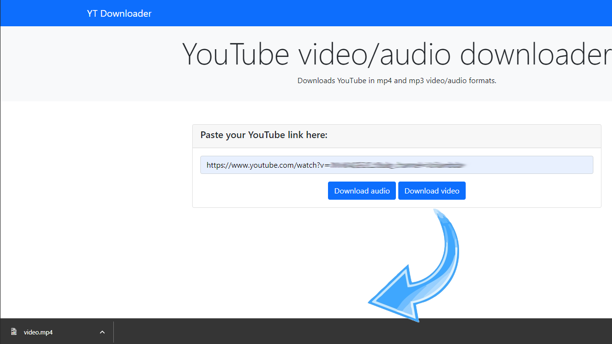

# YouTube Downloader module



## Overview

This application allows to download audio or video files from YouTube. Created with Django framework and Bootstrap, ensuring a fast and user-friendly experience. Allows you quickly and easily save your favorite YouTube videos to your device for offline viewing or listening, whether you're on a desktop or mobile device.

## Usage

> Python3 Required (Tested with Python 3.9.5 and Python 3.10.5)
> To clone and run this application, you'll need Git and Python installed on your computer. From your command line:

Windows:

```bash
# Clone this repository
$ git clone https://github.com/danilaveselov/ytdownloader.git

# Go into the repository
$ cd ytdownloader

# Create a new virtual environment
$ py -3 -m venv .venv_project

# Activate your virtual environment
$ .venv_project\Scripts\activate

# Install required requirements
$ pip install requirements/requirements.txt

# Run the project with
$ python manage.py runserver
```

MacOS/Linux:

```bash
# Clone this repository
$ git clone https://github.com/danilaveselov/ytdownloader.git

# Go into the repository
$ cd ytdownloader

# Create a new virtual environment
$ python3 -m venv .venv_project

# Activate your virtual environment
$ source .venv_project/bin/activate

# Install required requirements
$ pip install requirements/requirements.txt

# Run the project with
$ python manage.py runserver
```
